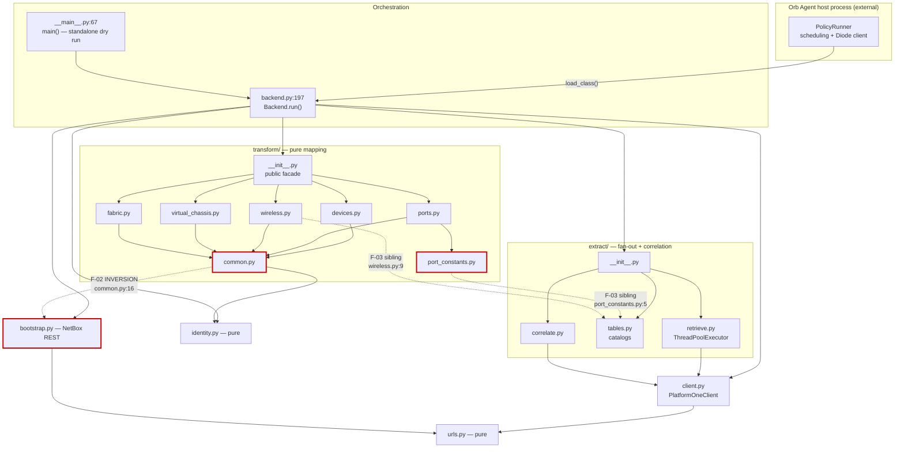
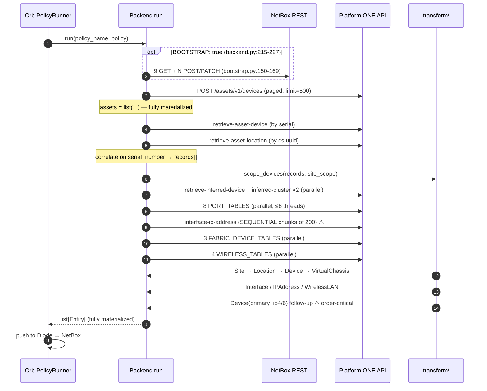
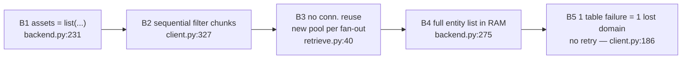

# Software Design Analysis — `netbox-orb-extreme-platformone`

| | |
|---|---|
| **Date** | 2026-07-28 |
| **Commit** | `2a54acd` (branch `claude/software-architecture-analysis-kuervi`) |
| **Scope** | `src/orb_extreme_platformone/**` (31 modules, 3,946 LOC), `tests/**` (16 modules, 3,782 LOC), `pyproject.toml`, `agent.yaml`, `.github/workflows/ci.yml` |
| **Verification** | `uv sync --locked --group dev` + `uv run pytest -q` → **210 passed, 7 deselected**. Import graph derived by AST walk over all 31 source modules. |

---

## 1. Executive summary

This is a **layered ETL pipeline** packaged as an Orb Agent worker plugin. The layering is real and mostly enforced: `urls` → `client` → `extract` → `transform` → `backend`. There are **no import cycles**, no God class in the classic sense, and the modules are small (median 103 LOC, largest source file 409 LOC). Degradation semantics are unusually well thought through — every ConfigState fan-out can fail a single table without aborting the tick.

The weaknesses are concentrated in four places:

1. **One genuine layering inversion** — the pure-mapping `transform` layer imports the NetBox-REST `bootstrap` module (§4, F-02) and the `extract` catalogs (F-03), so `import orb_extreme_platformone.transform` drags in `requests`.
2. **A dead CLI entrypoint** — `python -m orb_extreme_platformone` performs the entire API sweep and prints nothing (F-01). Confirmed by AST: the loop body is three `Assign` statements, and `_quote_values` is only ever called by itself.
3. **HTTP-layer resilience gaps** — no retry/backoff for 5xx/429, no connection reuse across fan-outs, sessions never closed (F-04, F-05).
4. **Load-bearing invariants encoded as comments** — entity emission order and the "record" dict shape are contracts held together by prose (F-08, F-09).

### Modularity rating: **8 / 10**

| Evidence for | Evidence against |
|---|---|
| Zero import cycles across 32 modules (AST-verified) | `transform/common.py:16` imports `bootstrap` — pure layer → I/O layer |
| Clean directional layering `urls → client → extract → transform → backend` | `transform/port_constants.py:5`, `transform/wireless.py:9` import `extract.tables` — sibling coupling |
| Small modules; catalogs centralized in one file (`extract/tables.py`) so table keys cannot drift | 35 distinct `_`-prefixed names imported across module boundaries inside `transform` — the "internal" API *is* the API |
| Per-domain fan-out isolated (`extract/{ports,wireless,fabric,clusters}.py`) behind one shared primitive (`extract/retrieve.py`) | The `{"asset","cs_device_id","cs_device","location"}` record dict is an untyped contract spanning 3 layers (11 `record["asset"]` sites) |
| `__init__.py` keeps `Backend` lazy so version metadata does not require the SDKs — smoke-tested in CI | `backend.py` accretes config resolution + scope parsing + indexing + orchestration + fan-out (7 module functions + 4 methods) |
| 210 tests, `ruff select = ["ALL"]`, `ty --error-on-warning`, coverage gate 90% | 9 functions take ≥6 parameters; `PLR0913`/`C901`/`PLR0912` globally disabled in `pyproject.toml:105-108` |

Not a 9–10 because a pure transform layer that cannot be imported without `requests` is a structural defect, not a style preference. Not a 7 because everything else about the decomposition is deliberate and defended in-code.

---

## 2. Architectural pattern

**Layered / Pipes-and-Filters ETL**, hosted as a **plugin** in the Orb Agent's process.

Not MVC (no view/controller). Not microservices (single process, single deployable wheel). The Orb Agent owns scheduling and the Diode gRPC client; this package implements one contract — `worker.backend.Backend` with `describe()` + `run()` (`backend.py:197-275`) — and returns entities. Inversion of control is total: the worker never pushes to Diode itself.

**Separation of concerns — yes, with two documented exceptions.**

| Layer | Modules | Responsibility | Purity |
|---|---|---|---|
| Validation | `urls.py` | HTTPS/userinfo enforcement | Pure |
| Transport | `client.py` | Auth, pagination, chunking, error mapping | I/O |
| Extract | `extract/{retrieve,tables,correlate,ports,wireless,fabric,clusters}.py` | Fan-out, bucketing, correlation, degradation | I/O orchestration |
| Transform | `transform/*` (15 modules) | ConfigState rows → Diode entities | Pure — **except** `common.py:16` |
| Schema setup | `bootstrap.py` | NetBox REST custom fields + tags | I/O |
| Orchestration | `backend.py`, `__main__.py` | Tick sequencing, config, scoping | Impure |

---

## 3. Architecture diagram

### 3.1 Layer dependencies (AST-derived, no cycles)



### 3.2 Data flow per policy tick



**Order is load-bearing** and enforced only by construction sequence in `backend.py:250-275`:
`Device(member)` → `VirtualChassis(master)` (NetBox rejects a master that is not yet a member) and `IPAddress` → `Device(primary_ip*)` (NetBox rejects `primary_ip` for an unassigned IP, dropping `serial`/CFs with it).

### 3.3 External integrations

| Service | Direction | Module | Auth | Notes |
|---|---|---|---|---|
| Platform ONE Assets API | out | `client.get_devices` | Bearer (static token or `/login`) | `page`/`limit`, `total_pages` |
| Platform ONE ConfigState API | out | `client.retrieve` | same bearer | `page_number`/`page_size`, `Pagination.total_pages` |
| Platform ONE `/login` | out | `client._login_locked:141` | user/pass | `allow_redirects=False`; refresh 60 s early |
| NetBox REST | out | `bootstrap.ensure_schema` | `Token` header | Bootstrap only; `allow_redirects=False` |
| Diode gRPC | out | **none — host-owned** | host | Worker only returns entities |

### 3.4 Bottlenecks



| # | Location | Impact |
|---|---|---|
| **B1** | `backend.py:231` | Whole Assets inventory in memory before any work starts |
| **B2** | `client.py:324-343` | `attach_interface_id_tables` passes *all* interface UUIDs at once → `ceil(N/200)` **sequential** round-trips, each internally paginated. Dominant wall-clock cost on large estates |
| **B3** | `extract/retrieve.py:40` | New `ThreadPoolExecutor` per fan-out (≈5/tick) → new threads → new thread-local `requests.Session` each. TLS handshake per table; `Session.close()` never called |
| **B4** | `backend.py:275` | Return type says `Iterable[Entity]`; implementation returns a fully built `list` |
| **B5** | `client.py:186-226` | Only 401 is retried. One 503/429 degrades an entire ConfigState table for the tick (`retrieve_ok` → `failed_tables`) |

---

## 4. Findings

Severity is **1–10, where 10 = most important**.

---

### F-01 · Severity **7** · `__main__` runs the full pipeline and emits nothing

**Category:** Dead code / broken feature.
**Location:** `src/orb_extreme_platformone/__main__.py:56-75`

The module docstring says "print entities" and `pyproject.toml:76` exposes it as the console script `orb-extreme-platformone`. The loop body is three assignments with no sink; `_quote_values` (line 56) is referenced only by its own two recursive calls. AST-verified:

```
loop body stmt types: ['Assign', 'Assign', 'Assign']
any print/logger call in loop: False
```

`ruff` does not catch it (module-level private functions are not flagged) and `pyproject.toml:96` omits `__main__.py` from coverage, so no gate sees it.

**Remediation** — `__main__.py:72-75`:

```python
    for entity in backend.run("standalone", policy):
        data = MessageToDict(entity, preserving_proto_field_name=True)
        ts = entity.timestamp.ToDatetime(tzinfo=timezone.utc).astimezone()
        data["timestamp"] = ts.isoformat(timespec="seconds")
        print(json.dumps(_quote_values(data), sort_keys=True))  # noqa: T201
```

with `import json` added at `__main__.py:11`. Then add `"T201"` to the `[tool.ruff.lint]` ignore list scoped to this file via `per-file-ignores`:

```toml
[tool.ruff.lint.per-file-ignores]
"src/orb_extreme_platformone/__main__.py" = ["T201"]  # dry-run CLI prints to stdout
```

---

### F-02 · Severity **7** · Layering inversion: `transform` imports `bootstrap`

**Category:** Tight coupling / dependency-flow violation.
**Location:** `src/orb_extreme_platformone/transform/common.py:16,23-30`

```python
from orb_extreme_platformone import bootstrap          # ← pulls in `requests`

PROVENANCE_TAGS = [tag["name"] for tag in bootstrap.TAGS]
CF_DEVICE_ID = bootstrap.CF_DEVICE_ID
...
```

The pure mapping layer depends on the NetBox-REST module for **six string constants and three tag names**. Consequences: `import orb_extreme_platformone.transform` transitively imports `requests`; unit-testing transforms drags in an HTTP client; and the dependency arrow points from the layer with no I/O to the layer that is nothing but I/O.

**Remediation** — introduce a leaf constants module both sides import.

New file `src/orb_extreme_platformone/schema.py`:

```python
"""NetBox schema identifiers shared by bootstrap (definitions) and transform (values)."""

from __future__ import annotations

CF_DEVICE_ID = "platformone_device_id"
CF_INTERFACE_ID = "platformone_interface_id"
CF_CLUSTER_ID = "platformone_cluster_id"
CF_ISIS_AREA = "platformone_isis_area"
CF_ISIS_SYSTEM_ID = "platformone_isis_system_id"
CF_SPBM_NICKNAME = "platformone_spbm_nickname"

TAG_NAMES = ("extreme-networks", "platform-one", "discovered")
```

`transform/common.py:16-30` becomes:

```python
from orb_extreme_platformone.schema import (
    CF_CLUSTER_ID, CF_DEVICE_ID, CF_INTERFACE_ID,
    CF_ISIS_AREA, CF_ISIS_SYSTEM_ID, CF_SPBM_NICKNAME, TAG_NAMES,
)

PROVENANCE_TAGS = list(TAG_NAMES)
```

`bootstrap.py:18-24` re-imports the same names from `schema` (keeping its module-level aliases so existing `bootstrap.CF_*` references and tests keep working), and `bootstrap.TAGS` keeps its full definitions. This leaves `transform` with a pure, `requests`-free dependency set.

---

### F-03 · Severity **6** · `transform` reaches sideways into `extract` catalogs

**Category:** Missing abstraction / sibling-layer coupling.
**Location:** `transform/port_constants.py:5`, `transform/wireless.py:9`

```python
from orb_extreme_platformone.extract.tables import INTERFACE_ID_TABLES, PORT_TABLES
PORT_ENTITY_TABLE_KEYS = frozenset(PORT_TABLES) | frozenset(INTERFACE_ID_TABLES)
```

The intent (documented at `port_constants.py:12-13`) is sound — derive the key sets so they cannot drift. The mechanism is wrong: the shared vocabulary lives inside the *extract* package, so the pure layer now depends on the I/O layer's internals.

**Remediation** — the catalogs are data, not extract logic. Move `extract/tables.py` to a top-level `catalog.py` (a leaf, importing nothing internal) and re-export for compatibility:

```python
# src/orb_extreme_platformone/extract/tables.py  — thin compatibility shim
from orb_extreme_platformone.catalog import (  # noqa: F401
    CLUSTER_MEMBER_FILTERS, FABRIC_DEVICE_TABLES,
    INTERFACE_ID_TABLES, PORT_TABLES, WIRELESS_TABLES,
)
```

Then `transform/port_constants.py:5` and `transform/wireless.py:9` import from `orb_extreme_platformone.catalog`, and the diagram's dashed sibling edges disappear without changing a single key.

---

### F-04 · Severity **6** · No connection reuse across fan-outs; sessions never closed

**Category:** Efficiency / resource leak.
**Location:** `client.py:123-128`, `extract/retrieve.py:39-43`

`_session()` caches a `requests.Session` on `threading.local()`. `retrieve_parallel` builds a **new** `ThreadPoolExecutor` on every call and lets it shut down at the `with` exit, destroying the threads — and with them, the cached sessions. A tick calls `retrieve_parallel` roughly five times (clusters ×1, ports ×1, interface-IPs ×1, fabric ×1, wireless ×1), so up to ~26 short-lived sessions are created and discarded, each paying a fresh TLS handshake. No `Session.close()` exists anywhere in the package (grep-verified).

**Remediation** — share one executor for the client's lifetime and give the client an explicit teardown.

`extract/retrieve.py:39-43`:

```python
_POOL_MAX_WORKERS = 8
_POOL = ThreadPoolExecutor(max_workers=_POOL_MAX_WORKERS, thread_name_prefix="p1-retrieve")

# ... inside retrieve_parallel, replace the `with ThreadPoolExecutor(...)` block:
    futures = [_POOL.submit(_one, table, filters) for table, filters in jobs]
    return [fut.result() for fut in futures]
```

Threads persist, so the thread-local sessions — and their urllib3 connection pools — are reused across every fan-out in the tick. Pair it with a disposal hook on the client (`client.py`, after `_session`):

```python
    def close(self) -> None:
        """Close this thread's HTTP session (call at end of a tick)."""
        session = getattr(self._local, "session", None)
        if session is not None:
            session.close()
            self._local.session = None
```

**Caveat:** a module-level pool is process-global. If the Orb Agent ever runs two policies concurrently in one process they share 8 workers. If that matters, hang the executor off `PlatformOneClient` instead and pass it into `retrieve_parallel`.

---

### F-05 · Severity **7** · No retry/backoff for 5xx, 429, or transient connection errors

**Category:** Missing abstraction / resilience.
**Location:** `client.py:186-226`

The `for attempt in (1, 2)` loop retries **only** HTTP 401 with username/password auth (line 205). Every other failure — `requests.RequestException` (line 197), 429, 500, 502, 503 — raises `PlatformOneApiError` immediately. Because `extract/retrieve.py:62-72` converts that into a `failed_tables` entry, **a single 503 silently costs an entire ConfigState table for the whole tick** (e.g. all PoE data, or all SSID configs). That degradation path is deliberate and well built; what is missing is the cheap retry in front of it.

**Remediation** — mount a `urllib3` retry adapter on each session. `client.py:123-128`:

```python
from requests.adapters import HTTPAdapter
from urllib3.util.retry import Retry

_RETRY = Retry(
    total=3,
    backoff_factor=0.5,                       # 0.5s, 1s, 2s
    status_forcelist=(429, 500, 502, 503, 504),
    allowed_methods=frozenset({"POST"}),      # every P1 endpoint is POST
    respect_retry_after_header=True,
    raise_on_status=False,
)


    def _session(self) -> requests.Session:
        session = getattr(self._local, "session", None)
        if session is None:
            session = requests.Session()
            session.mount("https://", HTTPAdapter(max_retries=_RETRY))
            self._local.session = session
        return session
```

`allowed_methods` must include `POST` explicitly — urllib3 excludes non-idempotent methods by default, and every Platform ONE read in this worker is a `POST`. Retrying reads is safe here; `/login` is also a POST but idempotent in effect.

---

### F-06 · Severity **6** · Every entity for the estate is materialized in memory

**Category:** Efficiency.
**Location:** `backend.py:231`, `backend.py:269-275`

```python
assets = list(client.get_devices(classification=classification))   # :231
...
entities.extend(port_entities)                                     # :269
return entities                                                    # :275  → list, not Iterable
```

`run()` is annotated `-> Iterable[Entity]`, so the host contract already permits streaming. For an estate of a few thousand switches at ~48 ports each, `entities` holds hundreds of thousands of protobuf messages simultaneously.

**Remediation** — convert `run` to a generator, preserving the load-bearing phase order (F-08). The phase *results* still need to be computed eagerly (primary IPs come from the port phase), but the entity list itself no longer needs to exist:

```python
    def run(self, policy_name: str, policy: Policy, **_kwargs) -> Iterable[Entity]:
        # ... unchanged setup through `_radio_entities` ...
        yield from transform.devices_to_entities(
            scoped,
            virtual_chassis_entities=vc_entities,
            vc_memberships=vc_memberships,
            fabric_by_cs_id=fabric_by_cs_id,
        )
        yield from port_entities
        yield from radio_entities
        yield from transform.primary_ip_device_entities(
            scoped, primary_ips_by_cs_id=primary_ips_by_cs_id,
        )
```

**Caveat — this changes observable behaviour:** the bootstrap call and every API request become lazy (nothing happens until the host iterates). `tests/test_backend_run.py` already wraps calls in `list(Backend().run(...))` (line 189), so it stays green, but `test_backend_config.py`'s "BOOTSTRAP without credentials raises `ValueError`" assertion will need `list(...)` around the call. Deeper streaming (yielding ports per device rather than accumulating in `_port_entities`) is the larger win but requires reworking the `primary_ips_by_cs_id` return contract; treat that as a follow-up.

---

### F-07 · Severity **5** · Interface-IP filter chunks are fetched sequentially

**Category:** Efficiency / bottleneck **B2**.
**Location:** `client.py:324-343`, `extract/ports.py:57-58`

`attach_interface_id_tables` builds one job containing **every** interface UUID across every in-scope switch (`extract/ports.py:57`, `interface_ids = sorted(interface_to_device)`). `client.retrieve` then splits it into 200-ID chunks and walks them in a plain `for` loop, each chunk internally paginated at 500. With 20,000 interfaces that is 100 sequential round-trips while the 8-thread pool sits idle — the single largest wall-clock cost of a tick, and it is the *only* fan-out that does not use `retrieve_parallel`.

**Remediation** — chunk at the caller, where the parallel primitive already exists. `extract/ports.py:57-66`:

```python
from orb_extreme_platformone.client import CONFIGSTATE_FILTER_CHUNK_SIZE

    interface_ids = sorted(interface_to_device)
    jobs, contexts = [], []
    for key, (table, filter_field) in INTERFACE_ID_TABLES.items():
        for start in range(0, len(interface_ids), CONFIGSTATE_FILTER_CHUNK_SIZE):
            chunk = interface_ids[start : start + CONFIGSTATE_FILTER_CHUNK_SIZE]
            jobs.append((table, {filter_field: chunk}))
            contexts.append(key)

    for key, rows in retrieve_ok(
        client, jobs, contexts,
        policy_name=policy_name, failed_tables=failed_tables,
        degradation="ports sync without it",
    ):
        ...  # unchanged
```

`retrieve_ok` already tolerates repeated context values and records per-chunk failures independently, so per-chunk degradation semantics are preserved. The `client.retrieve` internal chunking stays as a safety net for other callers.

---

### F-08 · Severity **5** · Order-critical entity emission is guarded only by comments

**Category:** Missing abstraction / temporal coupling.
**Location:** `backend.py:250-273`, `transform/devices.py:200-207`, `transform/devices.py:262-269`

Two NetBox constraints make list position semantically significant:

1. member `Device` before `VirtualChassis(master=...)` — **covered** by `tests/test_backend_run.py:404` (`kinds.index("device") < kinds.index("virtual_chassis")`).
2. `IPAddress` before the follow-up `Device(primary_ip4=...)` — **not covered**. `tests/test_backend_run.py:191-197` filters to `devices` only and asserts `devices[0]` lacks `primary_ip4` while `devices[1]` has it; it never checks the IPAddress entity's position. Reordering `entities.extend(port_entities)` after `primary_ip_device_entities` would keep all 210 tests green and silently break `serial`/custom-field writes in production.

**Remediation** — add the missing invariant test next to the existing one in `tests/test_backend_run.py`:

```python
def _kind(entity):
    return entity.WhichOneof("entity")


def test_primary_ip_device_follows_its_ip_address_entity() -> None:
    # ... same fixture setup as
    # test_run_sets_device_primary_ip_from_configstate_interface_cidr ...
    entities = list(Backend().run("platformone_worker", _policy()))
    kinds = [_kind(e) for e in entities]
    device_positions = [i for i, k in enumerate(kinds) if k == "device"]
    assert kinds.index("ip_address") < device_positions[-1], (
        "Device(primary_ip*) must be emitted after the IPAddress it references; "
        "NetBox rejects the update otherwise and drops serial/custom fields"
    )
```

---

### F-09 · Severity **5** · Primitive-obsession: the untyped "record" dict crosses three layers

**Category:** Missing abstraction.
**Location:** produced at `extract/correlate.py:112-119`; consumed in `backend.py` (`record["asset"]` ×5, `_fanout_context:177`, `_records_by_cs_id:135`), `transform/devices.py:132,220,242`, `transform/virtual_chassis.py:38,82-83`

The contract `{"asset": dict, "cs_device_id": str | None, "cs_device": dict | None, "location": dict | None}` is documented in a docstring (`transform/__init__.py:8-11`) and enforced nowhere. `ty` cannot check it; a typo in a key surfaces as a `KeyError` mid-tick. 19 subscript/`.get` sites depend on it.

**Remediation** — a frozen dataclass is a near-drop-in replacement (attribute access replaces `["asset"]`; `.get("location")` becomes `.location`). Add to `extract/correlate.py`:

```python
from dataclasses import dataclass


@dataclass(frozen=True, slots=True)
class DeviceRecord:
    """One Assets device joined with its ConfigState identity + location."""

    asset: dict
    cs_device_id: str | None
    cs_device: dict | None
    location: dict | None
```

and return `DeviceRecord(...)` from `correlated_records` (`correlate.py:112-119`). Because `slots=True` blocks `__dict__`, `ty` will flag every stale `record["asset"]` at check time rather than at runtime. This touches ~19 call sites and all transform fixtures — schedule it as its own change, not bundled with a behavioural fix.

---

### F-10 · Severity **4** · 35 cross-module private imports inside `transform`

**Category:** Missing abstraction / leaky internals.
**Location:** 23 import statements across `transform/*.py`; the structurally awkward one is `transform/lags.py:9`

```python
from .physical_ports import _iface_base_kwargs   # lags.py:9
```

The LAG builder reaches into the *physical port* module for a shared identity/PoE base (`physical_ports.py:58`). Neither module owns that helper; `physical_ports` merely happens to define it. Every `_`-prefixed name imported across a module boundary is a de-facto public API without the review discipline of one.

**Remediation** — relocate the genuinely shared builders to a neutral module and drop the underscore, signalling the real contract:

```python
# src/orb_extreme_platformone/transform/interface_base.py
"""Shared Interface kwarg builders used by physical-port, LAG, and radio mapping."""

from .common import _interface_identity_kwargs

def interface_base_kwargs(*, device, name, interface_id, config,
                          poe_state=None, poe_config=None) -> dict:
    ...   # body moved verbatim from physical_ports.py:58-80
```

`physical_ports.py` and `lags.py` both import `interface_base_kwargs` from it. Apply the same treatment to `_by_key` / `_first_row` / `_optional_first_row` in `port_join.py` (imported by four modules including `wireless.py:12`) — these are the package's join primitives and should be named as such.

---

### F-11 · Severity **4** · Inconsistent config resolution: `BOOTSTRAP` and `classification` ignore the environment

**Category:** Copy-paste divergence / config defect.
**Location:** `backend.py:215`, `backend.py:230` vs `backend.py:216-217`; `__main__.py:52`

```python
if _cfg(config, "BOOTSTRAP", False):                    # :215 — config only
    netbox_url = _cfg_or_env(config, "NETBOX_API_URL")  # :216 — config OR env
...
classification = _cfg(config, "classification", DEFAULT_CLASSIFICATION)  # :230 — config only
```

Two helpers exist (`_cfg`, `_cfg_or_env:88`) and the choice between them is inconsistent. Setting `BOOTSTRAP=true` in the container environment — the natural reading of `agent.yaml:32-44`, which resolves *its own* neighbours from `${...}` env — has no effect under Orb. Separately, `__main__.py:52` reads `PLATFORMONE_CLASSIFICATION`, an env var `backend.py` never consults, so the two entrypoints disagree on how classification is configured.

**Remediation** — `backend.py:215` and `:230`:

```python
        if _env_bool_like(_cfg_or_env(config, "BOOTSTRAP", default=False)):
        ...
        classification = _cfg_or_env(config, "classification", default=DEFAULT_CLASSIFICATION)
```

with a small coercion helper next to `_cfg_or_env` (env values arrive as strings, so a bare `if "false"` would be truthy):

```python
def _env_bool_like(value, *, default: bool = False) -> bool:
    """Policy config bools pass through; env strings coerce (`false`/`0`/`no` → False)."""
    if isinstance(value, bool):
        return value
    if value is None:
        return default
    return str(value).strip().casefold() in {"1", "true", "yes", "on"}
```

Then rename `__main__.py:52`'s env key to `classification` (or have `_standalone_config` read both) so the two entrypoints agree. This duplicates the coercion already in `__main__._env_bool:21` — better still, move `_env_bool` into `backend.py` and have `__main__` import it.

---

### F-12 · Severity **4** · Filter chunking silently disables itself with >1 list filter

**Category:** Fragile implicit contract.
**Location:** `client.py:317-320`

```python
list_fields = [(key, value) for key, value in filters.items() if isinstance(value, list)]
if len(list_fields) == 1:
    field, values = list_fields[0]
    if len(values) > filter_chunk_size > 0:
```

Every current catalog entry sends exactly one list (`extract/retrieve.py:103`), so this works today. The moment a table needs two list filters, chunking vanishes with no warning and a 10,000-ID body goes to the gateway — the exact failure the chunking was built to prevent (`client.py:38-40`).

**Remediation** — chunk the longest list instead of bailing out; add a warning for the multi-list case. `client.py:317`:

```python
        list_fields = [(k, v) for k, v in filters.items() if isinstance(v, list)]
        if list_fields:
            field, values = max(list_fields, key=lambda item: len(item[1]))
            if len(list_fields) > 1:
                logger.warning(
                    "retrieve-%s has %d list filters; chunking only %r (%d values)",
                    table, len(list_fields), field, len(values),
                )
            if len(values) > filter_chunk_size > 0:
                ...  # unchanged chunk loop
```

---

### F-13 · Severity **3** · Pagination loop has no upper bound

**Category:** Robustness.
**Location:** `client.py:241-248`

```python
        page = 1
        while True:
            payload = self._post(path, {page_param: page, size_param: size}, body)
            yield from payload.get(response_key) or []
            last_page = total_pages(payload, page)
            if page >= last_page:
                break
            page += 1
```

Termination depends entirely on the server reporting a sane `total_pages`. A gateway that always returns `total_pages: 999999` produces an unbounded loop at 60 s timeout per request, with no log line indicating why the tick never finishes.

**Remediation** — `client.py:46` and `:241`:

```python
# Guard against a server that never stops reporting more pages.
_MAX_PAGES = 10_000

        while True:
            ...
            if page >= last_page:
                break
            if page >= _MAX_PAGES:
                logger.warning(
                    "Stopping %s pagination at page %d (server reported %s pages)",
                    path, page, last_page,
                )
                break
            page += 1
```

---

### F-14 · Severity **3** · Duplicate ConfigState ids yield a Device with no ports, asymmetrically

**Category:** Correctness edge case.
**Location:** `backend.py:118-139` vs `transform/devices.py:236-248`

`_records_by_cs_id` keeps the first record per `cs_device_id` and warns (`:130`). But `devices_to_entities` iterates the *unfiltered* scoped list, so **both** Assets rows still produce `Device` entities — one of which will never receive ports, radios, VC membership, or fabric CFs. The warning names the dropped device but not the consequence.

**Remediation** — minimal, non-behavioural: make the log line state the effect, `backend.py:130-136`:

```python
            logger.warning(
                "Duplicate ConfigState device id %s across Assets rows (%r and %r); "
                "keeping the first — %r will sync as a Device with no ports/radios/VC",
                cs_id,
                asset_label(by_id[cs_id]["asset"]),
                asset_label(record["asset"]),
                asset_label(record["asset"]),
            )
```

Suppressing the duplicate `Device` entirely is the alternative, but that would stop syncing a device NetBox may legitimately want; the log fix is the safe first step.

---

### F-15 · Severity **3** · `bootstrap` issues 9–27 sequential un-pooled, un-retried REST calls

**Category:** Efficiency.
**Location:** `bootstrap.py:129-141`, `bootstrap.py:150-169`

`_request` calls `requests.request(...)` directly — a fresh connection and TLS handshake per call, no `Session`. `_ensure_all` runs one `GET` per definition plus an optional `POST`/`PATCH`, for 6 custom fields and 3 tags: 9 GETs minimum, up to 27 calls on a cold NetBox. No retry wraps any of them, and `resp.raise_for_status()` (line 140) aborts the whole tick on a single transient 502.

Bootstrap is a once-per-upgrade operation, which is why this is severity 3 rather than 6.

**Remediation** — thread a session through, reusing the retry policy from F-05:

```python
def ensure_schema(netbox_url: str | None, netbox_token: str | None) -> None:
    if not netbox_url or not netbox_token:
        return
    base = require_https_url(netbox_url, what="NETBOX_API_URL")
    with requests.Session() as session:
        session.mount("https://", HTTPAdapter(max_retries=_RETRY))
        _ensure_all(f"{base}/api/extras/custom-fields/", netbox_token, CUSTOM_FIELDS, session=session)
        _ensure_all(f"{base}/api/extras/tags/", netbox_token, TAGS, session=session)
```

with `_request`/`_lookup`/`_ensure_all` taking `session` and calling `session.request(...)`. `_RETRY` should allow `GET`, `POST`, and `PATCH` here (all idempotent given the lookup-then-write structure).

---

### F-16 · Severity **2** · `README.md` is the architecture spec (38 KB, 617 lines, 30 headings)

**Category:** Maintainability.
**Location:** `README.md`

Sections `### Switch ports` (line 427), `### LAG interfaces and membership` (479), `### VirtualChassis from inferred clusters` (556) document mapping rules that live in `transform/`. They are accurate today because the code carries matching docstrings — meaning the same rule is stated twice, in two files, with nothing keeping them in sync.

**Remediation** — keep operator-facing content (quick start, configuration, auth, security) in `README.md`; move `## Design notes` (line 293 onward, ~320 lines) to `docs/design-notes.md` and link it. The per-field rules already have a canonical home in the transform docstrings; the doc should point at them rather than restate them.

---

## 5. Anti-pattern checklist

| Anti-pattern | Verdict | Evidence |
|---|---|---|
| **Spaghetti code** | **Not present** | Strict layering, AST-verified acyclic import graph, no global mutable state outside the deliberate thread-local session cache |
| **Copy-paste programming** | **Localized** | `__main__._env_bool:21` vs `backend._cfg_or_env:88` — two parallel config-resolution paths with divergent key sets (F-11). Elsewhere actively avoided: `_INTERFACE_ID_SOURCE_KEYS` (`extract/ports.py:15`) and `PORT_ENTITY_TABLE_KEYS` (`port_constants.py:14`) are *derived* from catalogs specifically to prevent duplication |
| **God classes / modules** | **Mild** | `backend.py` (409 LOC) holds config resolution + scope parsing + record indexing + orchestration + three fan-out methods. No God *class* — `Backend` has 4 methods, 3 of them `@staticmethod`; the accretion is at module level. Below the threshold that demands a split, above the threshold that deserves a note |
| **Tight coupling** | **Present** | F-02 (`transform`→`bootstrap`), F-03 (`transform`→`extract.tables`), F-10 (35 cross-module private imports) |
| **Missing abstractions** | **Present** | F-05 (no retry policy object), F-08 (ordering invariant is prose), F-09 (untyped record dict), F-10 (no shared interface-builder module) |
| **Feature envy** | **Minor** | `transform/virtual_chassis.py:38-39` re-derives site via `resolve_location(record.get("location"), asset)` — already computed in `backend._fanout_context:178`. Cheap, but a symptom of F-09: with a typed record the resolved site could be carried, not recomputed |
| **Primitive obsession** | **Present** | F-09; also `dict[str, dict[str, list[dict]]]` as the universal table-bucket type across `extract/` and `transform/` |
| **Long parameter lists** | **Present** | 9 functions with ≥6 params; `_physical_port_entities` (`physical_ports.py:137`) takes **11**. `PLR0913` is globally disabled at `pyproject.toml:107` — the check is off rather than the smell addressed |
| **Magic numbers** | **Well handled** | Constants named and sourced (`client.py:35-46`, `port_constants.py:31-51`), each with a provenance comment. Exception: `workers = min(len(jobs), 8)` (`retrieve.py:39`) is an unnamed inline literal — fixed by F-04's `_POOL_MAX_WORKERS` |
| **Swallowed exceptions** | **Deliberate, not accidental** | Every `except PlatformOneApiError` logs with a `degradation` string naming what the tick loses (`retrieve.py:64-71`, `correlate.py:80-86`, `backend.py:295-304`). This is the codebase's strongest design feature |

---

## 6. Unable to verify

| Claim | Why | What would prove it |
|---|---|---|
| Diode/NetBox rejects name-only nested `Device` stubs during `generate-diff` | Asserted at `transform/common.py:45-53` and `virtual_chassis.py:32-37`; `netboxlabs-diode-sdk` is stubbed out for `ty` (`pyproject.toml:145-149`) and no test exercises a real Diode server | An integration test against a live Diode + NetBox, or a linked issue/commit in `netboxlabs-diode-sdk` |
| `AssetLagConfig.enabled` is "false for every in-service MLT" | Stated at `lags.py:29-32` as production dry-run observation; no fixture reproduces it | A recorded `responses` fixture from a production dry run, checked in under `tests/fixtures/` |
| ConfigState `oper_speed` / `connector_type` integer codes beyond `{4, 1, 2}` | `port_constants.py:29-31` says only these are verified; the OpenAPI spec has no value table and sits behind the vendor's login wall (`.github/workflows/ci.yml`, closing comment) | Running `pytest -m contract` against locally downloaded specs (`tests/test_openapi_contract.py`), plus hardware fixtures for additional codes |
| The `/login` response uses `expires_in` seconds | `client.py:169-171` assumes it; falls back to `_DEFAULT_TOKEN_TTL_SECONDS = 86400` | The ExtremeCloud IQ `/login` OpenAPI schema, or a captured response fixture |
| Actual per-tick wall-clock cost of B2 (sequential chunking) | No profiling harness in-repo; estate size unknown | Timing instrumentation around `attach_interface_id_tables` on a real tick, or a `responses`-backed benchmark with N=20,000 interface IDs |

---

## 7. Suggested sequencing

| Order | Findings | Rationale |
|---|---|---|
| 1 | **F-01**, **F-11** | Small, self-contained, fix user-visible breakage |
| 2 | **F-05**, **F-13**, **F-15** | HTTP resilience; independent of any structural change |
| 3 | **F-08** | Lock the ordering invariant *before* touching `run()` |
| 4 | **F-02**, **F-03**, **F-10** | Structural cleanup; pure import moves, no behaviour change |
| 5 | **F-04**, **F-07**, **F-06** | Performance; F-04 and F-07 both touch `retrieve.py` — do together |
| 6 | **F-09**, **F-12**, **F-14**, **F-16** | Larger refactor + documentation; no urgency |
